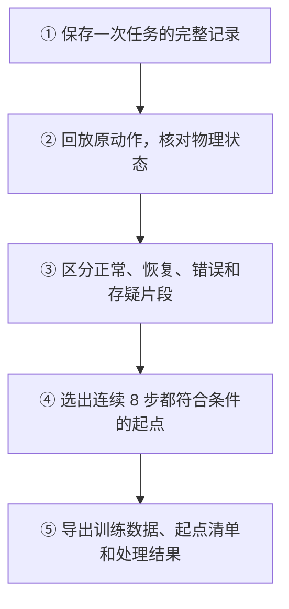

# Data Dump 功能概览

Data dump 把机器人一次任务中保存的画面、状态、动作和决策记录整理成可追溯的数据，再根据离线回放的证据，选出可供 WLA 动作模型学习的片段。

**筛选以动作片段为单位。** 例如，一次任务中先抓空、再重新抓住物体，系统会尝试区分错误、纠正和正常推进的动作；任务最终失败，也可能留下有明确进展的局部片段。

## 整体流程

运行时自动保存原始记录；任务结束后，由操作者启动离线流程。目前不会自动接着执行筛选和导出。

## 每一步具体做什么

### ① 保存：留下完整的任务经过

保存前视和腕部画面、动作前的机器人状态、执行的动作、任务结果，以及已有的 Agent 决策。成功和失败记录都可以保留用于分析。

例如，机器人第一次抓取失败、第二次成功，两次尝试都会留下记录，便于之后判断哪里出错、如何恢复。

### ② 回放：确认动作实际造成了什么结果

在独立仿真环境中重放已记录的动作，逐步核对机械臂末端位置和任务成功结果，并补充物体移动、夹爪接触、抽屉位置等证据。回放不请求模型生成新动作，得到的状态只用于离线分析。

例如，夹爪闭合只能说明“发出了抓取动作”；还要结合接触、物体是否抬起并随手移动等证据，才能判断是否抓住。回放与原记录不一致的轨迹会被拒绝，并记录原因。

### ③ 分类：给动作片段标明依据

| 分类 | 表示什么 | 例子 |
| --- | --- | --- |
| 正常推进 | 有后续抓取或目标达成等进展支持，且未被规则判为错误或存疑。 | 接近目标后抓住物体，并继续完成放置。 |
| 错误后的恢复 | 先有明确错误，后有纠正证据。 | 确认抓空后重新调整，直到再次抓住目标。 |
| 错误 | 有物理证据支持的错误动作。 | 抓住了错误物体，或移动了错误抽屉。 |
| 存疑 | 证据不足，或暂时无法确认后续进展。 | 夹爪反复开合，但无法确认是否抓空。 |

当前规则会排除持续拿着错误物体的动作；错误抽屉尚未恢复时，也不会因为后来完成了目标，就把后续动作认定为正常或已恢复。不能确定是正常放手还是掉落时，会保留为存疑。

慢速、绕行和重复开合夹爪会作为复核线索保存，**目前不会据此自动剔除片段**。例如，多次开合也可能是放下一个物体后再抓取另一个，不能仅按次数认定错误。

### ④ 筛选：确定哪些位置可以开始一个训练样本

一个起点要入选，后续连续 8 个动作必须全部属于同一类“正常推进”或“错误后的恢复”，且证据已确认、所需状态完整，还要有执行完这 8 步后的真实画面。

例如，连续 8 步中只要夹着一步存疑，或从正常推进跨入恢复，这个起点就不会入选。使用人工限定范围时，动作和后续画面也都必须落在批准范围内。

### ⑤ 导出：保留上下文，让训练按清单取片段

质量流程保留获选轨迹的完整任务记录，用起点清单指定训练实际读取的位置，避免截断后丢掉原始历史画面。正常推进片段和恢复片段可以一起读取，也可以分开使用。

| 得到的内容 | 可以用来做什么 | 例子 |
| --- | --- | --- |
| WLA 训练数据和起点清单 | 读取双视角画面、状态、连续动作和任务文字。 | 从一次完整任务中，只读取符合条件的片段。 |
| 原始经过、回放证据和标签 | 追溯判断依据与规则版本。 | 查某段为什么标成错误，或为什么没有入选。 |
| 复核线索与处理汇总 | 定位值得查看的动作，了解拒绝原因和入选数量。 | 找到绕行片段，或确认某条轨迹因视频损坏被拒绝。 |

## 人工检查如何配合

已有人工复核页面可查看动作前后的双视角关键帧和完整视频，给动作标记“正常、纠正、错误、看不清”，并决定保留整条、保留区间、不纳入或仅用于验证。关键帧便于定位问题，确认连续片段仍需查看完整经过。

人工复核是另行启动的流程。自动质量流程会生成复核线索，但不会自动等待人工审批。基础导出和人工复核导出仍要求原任务成功；从失败任务中提取局部可用片段，由质量流程处理。

## 出错时如何处理

- **单条数据出错：**缺文件、格式错误、视频损坏或回放不一致等问题会记录拒绝原因，其余来源继续处理。例如，批量中一条视频损坏，其余合格轨迹仍可导出。
- **全部不入选：**保留处理结果和零计数汇总，不生成空训练集。
- **导出过程故障：**程序、依赖或系统故障仍会中止。训练数据先写入临时位置，写入完成后才移到正式位置；发生故障后需要换一个空输出位置重跑，目前不支持断点续跑。

## 当前能力的边界

- **任务范围：**自动标签支持 LIBERO 仿真中的放上、放入、打开和关闭目标。其他任务或缺少必要物理证据的片段保持存疑。
- **数据要求：**现有训练格式需要前视、腕视、8 维状态、7 维动作和真实后续画面；初始化动作不进入训练。
- **质量判断：**“已确认”表示满足现有证据规则，不代表动作最优、最高效，也不保证加入训练后一定有效。入选还需符合数据用途要求；当前 Pro 评测数据仅用于验证。
- **验证程度：**现有测试覆盖多种分类、筛选和批量异常场景，但尚无完整的逐动作人工标准答案，不能给出整体标签准确率。此前 4 条轨迹的监督抽查针对旧版 rules-007，不能直接作为当前 rules-008 的验证结论。
- **其他能力：**已有 Agent 决策可追溯，尚未自动整理成 Agent 训练集；暂不支持自动调度和增量追加。

操作方法和字段说明见 [详细说明](DATA_DUMP.zh.md)。
