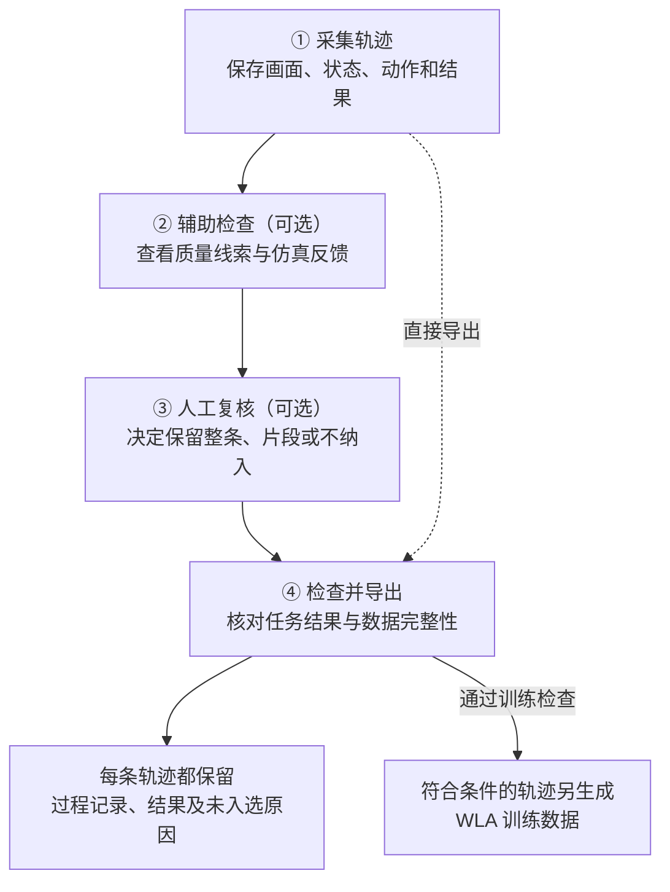

# Data Dump 功能概览

data dump 将机器人一次运行中的画面、状态、动作、决策和最终结果整理在一起，方便回查。符合条件的成功轨迹可以进一步导出为 WLA 训练数据；质量提示、仿真回放和人工复核则帮助判断哪些片段值得保留。

**例子：**机器人执行“把黑碗放到盘子上”。通过导出的记录，可以查看它当时看到了什么、执行了哪些动作，以及任务是否成功。符合训练条件时，这些画面、状态和动作还能组成训练样本。

## 1. 目前具备的能力

| 能力 | 具体作用 | 例子 |
| --- | --- | --- |
| 回查运行过程 | 关联画面、实际动作、Agent 决策和模型请求，保留成功与失败轨迹。 | 从一次“抓碗”决策，找到模型收到的图片、给出的回复和机器人实际执行的动作。 |
| 汇总任务结果 | 记录任务成败、动作数、记录完整性，以及是否入选训练和原因。 | 某条轨迹因任务失败未入选，仍可查看完整过程。 |
| 导出 WLA 训练数据 | 将合格轨迹中的任务指令、双视角画面、机器人状态和动作对齐保存。 | 第 20 个动作与执行它之前的前视图、腕视图和机器人状态配成一帧数据。 |
| 辅助人工复核 | 提供质量线索、动作前后画面和完整视频，支持保留整条或连续片段。 | 标出“夹爪闭合→张开→再闭合”的位置，供审核者判断是否为正常调整。 |
| 补充仿真反馈 | 原始任务和初态齐全时，重放已记录动作，查看目标条件与相关物体的位置。 | 检查放置动作后，目标碗是否满足“在盘子上”的条件。 |

## 2. 从运行记录到训练数据

第 ②、③ 步按需进行。直接导出时，系统依据技术检查和官方任务结果筛选训练数据；提供人工审核决定后，还会按决定保留或排除轨迹与片段。

1. **采集轨迹：保存当时发生了什么。**

   记录每个动作前的双视角画面和机器人状态、实际执行的动作、任务结果，以及已有的 Agent 决策和模型请求。例如，抓碗前的画面会与随后执行的抓取动作对应起来。

2. **辅助检查：找出需要进一步查看的位置。**

   核对记录完整性，提示夹爪反复开合等变化。任务定义和初态齐全时，还可以重放已记录动作，补充每步之后的目标状态。例如，画面中碗似乎到了盘边，可以通过回放确认目标条件是否成立。

3. **人工复核：决定哪些动作进入训练。**

   结合关键帧和完整视频，选择保留整条、保留连续片段，或不纳入训练。例如，剔除中间一段动作后，前后保留的部分分别成为独立片段。

4. **检查并导出：保留运行记录，生成合格的训练数据。**

   每条轨迹都写入过程记录和结果说明。官方成功、记录完整、动作与双视角画面对齐，并满足审核要求的轨迹，才进入 WLA 训练数据。例如，一段保留了 20 个连续任务动作的记录，可提供 12 个完整的 8 步训练起点；失败轨迹会留下未入选原因。

## 3. 主要产物

| 产物 | 内容 | 使用例子 |
| --- | --- | --- |
| `trace.jsonl` | 成功和失败轨迹中的逐步事件、决策与模型请求。 | 回查某次模型请求的输入、回复和对应动作。 |
| `feedback.jsonl` | 每条轨迹的任务结果、入选情况和未入选原因。 | 查看“任务失败，未进入 WLA 训练数据”的记录。 |
| `dump-manifest.json` | 导出规则，以及训练片段与原始轨迹的对应关系。 | 确认某个训练片段来自哪次运行、保留了哪些动作。 |
| `rua_lerobot` | 符合条件的 WLA 训练数据。 | 供训练程序读取视频、机器人状态和动作。 |
| 复核材料与仿真反馈 | 单独生成的审核页面、审核决定和逐步目标结果。 | 对照动作前后画面与目标状态，决定保留哪些片段。 |

如果一批轨迹全部未入选，仍会保留运行记录、结果汇总和导出说明，供后续分析。

## 4. 能力边界

- **动作质量仍需人工判断。** 整条任务成功只能说明最终结果；夹爪变化和步数差异只能提供线索。例如，机器人可能经过多次调整才完成任务，这些恢复动作是否值得训练，需要结合完整过程判断。
- **训练前需确认数据用途。** 自动筛选依据记录完整性和官方结果；评测数据只用于验证，避免混入训练。
- **训练样本依赖完整记录。** 缺少动作前状态、画面对不上动作，或执行结果不确定时，轨迹只能用于分析。例如，早期记录缺少的逐帧状态无法事后精确补齐。
- **训练格式有固定要求。** 当前流程需要前视和腕视两路画面、8 维机器人状态、7 维动作，以及至少 9 帧的连续片段。例如，改为单相机训练时，需要调整数据读取方式和训练配置，再验证效果。
- **Agent 训练集尚未生成，WLA 训练收益仍待验证。** 当前记录可用于研究决策，但还没有自动标注每步决策的好坏。已有导出和小样本筛选检查，也尚未证明这些数据能提高 WLA 的训练效果。
