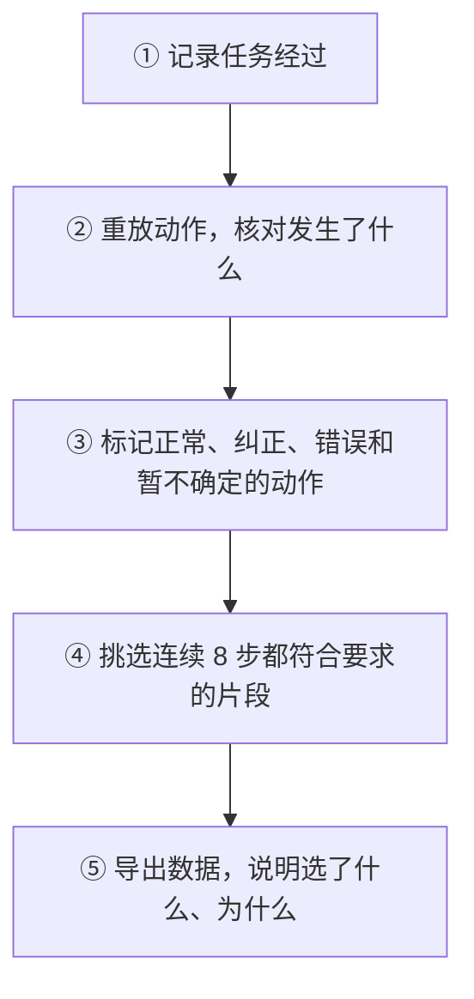

# Data Dump 功能概览

Data dump 用来整理机器人做任务时留下的记录，并从中挑选用于训练动作模型的片段。它会保留原来的画面、动作和判断过程，方便之后查看每段为什么被选中，或为什么没有被选中。

例如，机器人先抓空，调整后才抓住碗，系统会分别标记抓空和后续纠正的动作。一次任务最终失败，也可能有部分动作被保留下来用于训练。

## 整体流程

任务执行时会自动保存记录。任务结束后，需要手动启动回放、筛选和导出。

## 每一步具体做什么

### ① 记录任务经过

记录包括前方和腕部相机的画面、动作前机器人的位置和姿态、执行的动作、任务结果，以及已有的决策记录。任务成功或失败，都可以留下来分析。

例如，第一次没抓住、第二次抓住了，两次尝试都会保留，方便检查问题出在哪里。

### ② 重放动作，核对发生了什么

系统在单独的仿真环境里，按原记录重新执行动作，核对机器人手部的位置和任务结果是否一致，同时查看物体有没有移动、夹爪有没有抓住东西、抽屉有没有被拉开。回放执行的是保存下来的动作，不需要模型重新决定怎么做。

例如，夹爪合上了，不一定就是抓住了碗。还要看夹爪与碗的接触情况，或碗是否被抬起并跟着手移动。如果回放结果与原记录不一致，这条记录就不进入训练，并注明原因。

### ③ 给动作打标签

| 分类 | 表示什么 | 例子 |
| --- | --- | --- |
| 正常 | 后续确实抓住了目标或完成了任务，当前规则也没有发现这段动作有问题。 | 接近碗后抓住它，随后完成放置。 |
| 纠正 | 前面确认出了错，后面又确认改正了；标记中间符合条件的调整动作。 | 抓空后调整位置，直到重新抓住碗。 |
| 错误 | 记录能支持明确的错误判断。 | 抓住了错误物体，或拉动了错误抽屉。 |
| 暂不确定 | 现有记录还不能判断清楚。 | 夹爪反复开合，但无法确认是不是抓空。 |

持续拿着错误物体的动作不会入选。拉错抽屉后，如果没有把它放回原位附近，即使后来打开了正确抽屉，也不能算前面的错误已经改正。分不清是正常放手还是物体掉落时，就标为暂不确定。

做得慢、绕路、反复开合夹爪，或较长时间几乎没有动作变化，都会在符合条件时提示人工查看，**目前不会因为这些提示直接删除片段**。例如，多次开合可能是在依次抓放不同物体，不能仅按次数判错。

### ④ 挑选能用于训练的片段

模型一次学习连续 8 个动作。要选中这 8 步，必须同时满足：

- 全部标为正常，或者全部标为纠正，不能混在一起。
- 判断有足够依据，所需记录齐全。
- 保留了执行完这 8 步后的真实画面。
- 如果人工指定了保留范围，动作和后续画面都在这个范围内。

例如，8 步里有 7 步正常、1 步暂不确定，这一组就不选。前 4 步正常、后 4 步纠正，也不能放进同一个训练样本。

### ⑤ 导出数据和处理结果

一条任务记录只要有片段入选，就会保留完整的任务数据，再附上清单，告诉训练程序从哪些位置取连续 8 步。这样，模型需要查看前面的画面时，仍能找到原来的记录。

| 得到的内容 | 可以用来做什么 | 例子 |
| --- | --- | --- |
| 训练数据和选取清单 | 告诉训练程序哪些动作可以读取。 | 只学习任务中符合要求的片段。 |
| 原始记录、回放结果和标签 | 查看每个判断的依据。 | 查清某段为什么被标成错误。 |
| 待检查提示和处理汇总 | 查看哪些地方值得再看一遍，以及选中了多少数据。 | 找到绕路的动作，或查看某条记录未入选的原因。 |

## 人工可以检查什么

人工检查页面可以查看动作前后的两路相机画面和完整视频，给动作标记“正常、纠正、错误、看不清”，也可以决定保留整条、只保留某段、不纳入或仅用于验证。抽出的几张画面方便定位问题；要确定一整段是否可用，仍需查看完整经过。

人工检查需要单独启动。自动筛选会留下待检查提示，但不会停下来等待人工审批。已有的基础导出和人工检查导出仍要求任务最终成功；前面介绍的按动作筛选流程，才会从失败任务里挑选局部可用片段。

## 出错时如何处理

- **某条记录有问题**：缺文件、视频损坏或回放不一致等问题会注明原因，其他记录继续处理。
- **一条也没选中**：仍会保存处理结果，说明为什么没有可用数据。
- **程序或运行环境出错**：处理会停止。训练数据写完后才移到正式保存位置；发生故障后，需要换一个空位置重新运行，目前不能从中断处接着做。

## 目前能做到什么，还不能确定什么

- **支持的任务有限**。目前能判断 LIBERO 仿真中把物体放上、放入，以及打开、关闭抽屉这类任务。其他任务或记录不足时，先保留为暂不确定。
- **正常不等于做得最好**。标签主要根据后续结果和已发现的问题来判断，不能保证每一步都高效，也不能保证选出的数据一定能提升模型。
- **还没有整体准确率**。现有测试检查了多种分类、筛选和出错情况，但没有人逐步标完全部动作，作为完整的对照答案。此前四条任务的抽查针对旧版规则，也不能直接代表当前版本。
- **选中不等于允许用于训练**。仍需确认数据用途；当前 Pro 评测数据只用于验证。
- **训练数据有固定要求**。需要两路相机画面，以及配套的位置、姿态和动作记录。任务开始前用于稳定环境的动作不会进入训练。
- **有些工作还需要手动完成**。目前不会自动安排筛选任务，也不能向已有导出结果继续追加数据。已有决策记录可以查看，但还没有自动整理成训练决策模型的数据。

操作方法和字段说明见 [详细说明](DATA_DUMP.zh.md)。
